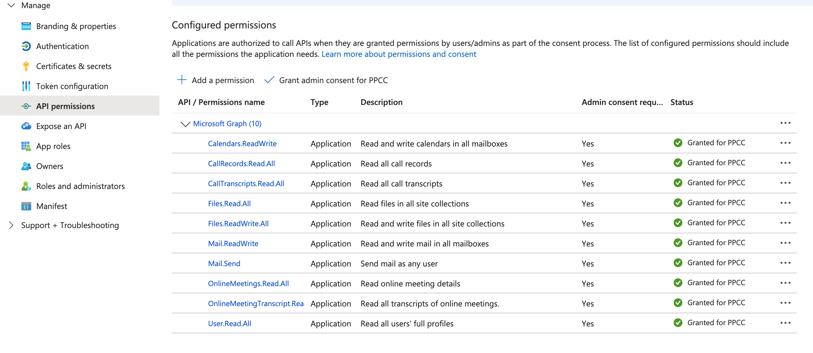
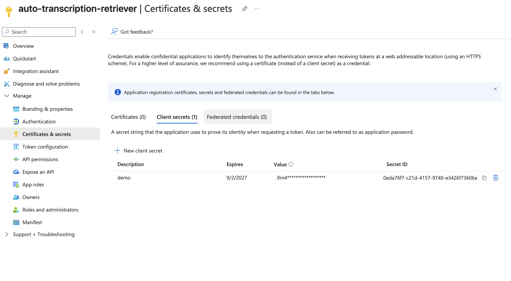
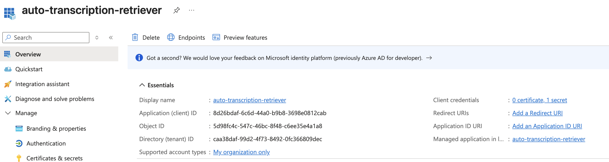

# Transcript Retriever

This project subscribes to Microsoft Graph notifications for meeting transcripts and provides a Cloud Function to receive the notifications and fetch the transcript content.

After retrieving the transcript, the following steps are performed:
- The transcripts are stored in the local recordings folder for each user that was invited to the meeting. This can be used for developing further conversational capabilities using the OneDrive connector
- The transcripts are summarized and action items are generated using Gemini
- The summary is then:
  - Sent to the Organizer via email
  - Appended to the calendar invite for others to view

# Architecture


## Deployment

### Step 1
Create an app registration on portal.azure.com

### Step 2
Give the app the following permissions


### Step 3
Create a client secret and copy the key


### Step 4
Update access policies for the app. We ran these powershell command:

```
New-CsApplicationAccessPolicy -Identity transcript-policy -AppIds "8d26bdaf-6c6d-44a0-b9b8-3698e0812cab" -Description "This allows the agent to retrieve transcripts on behalf of users" 

Grant-CsApplicationAccessPolicy -PolicyName transcript-policy -Global
```

More on access policies here: https://learn.microsoft.com/en-us/graph/cloud-communication-online-meeting-application-access-policy#supported-permissions-and-additional-resources

### Step 5
Take the application id + tenant id for the app registration and the key you just created and configure the variables in a .env file (example provided in .env.example)



### Step 6
Create the secrets in Google Cloud Secret Manager. The deploy commands below expect these secrets to verify the tenant and authenticate with Microsoft Graph.

```bash
printf "your-client-id" | gcloud secrets create CLIENT_ID --data-file=-
printf "your-client-secret" | gcloud secrets create CLIENT_SECRET --data-file=-
printf "your-tenant-id" | gcloud secrets create TENANT_ID --data-file=-
```

### Step 7
Create the Pub/Sub topic that the receiver will publish to.

```bash
chmod +x create-topic.sh
./create-topic.sh
```

### Step 8

Deploy the transcrip receiver and processor

To deploy the Cloud Function, you will need to have the [Google Cloud SDK](https://cloud.google.com/sdk/docs/install) installed and configured.

Run the following command to deploy the function:

    ```sh
gcloud run deploy transcription-receiver \
  --function main \
  --source receiver/ \
  --base-image python313 \
  --region europe-west1 \
  --env-vars-file=.env \
  --set-secrets="TENANT_ID=TENANT_ID:latest" \
  --max-instances 10 \
  --allow-unauthenticated
    ```

```bash
gcloud run deploy transcript-processor \
  --function main \
  --source processor/ \
  --base-image python313 \
  --region europe-west1 \
  --env-vars-file=.env \
  --set-secrets="CLIENT_ID=CLIENT_ID:latest,CLIENT_SECRET=CLIENT_SECRET:latest,TENANT_ID=TENANT_ID:latest" \
  --max-instances 20

```

**Note:**
- Replace the region with the Google Cloud region where you want to deploy the function (e.g., `us-central1`).

### Step 9
Create the Pub/Sub subscription that triggers the processor function.

```bash
chmod +x create-subscription.sh
./create-subscription.sh
```

### Step 10

In the .env file, replace the NOTIFICATION_URL with the URL of the function called transcription-receiver that is created in Step 6

### Step 11
Run subscribe.py to create a subscription to call and meeting transcripts.


## Local Testing

You can test your function locally without deploying it to the cloud. The `functions-framework` provides a local development server.

1.  **Start the local server:**

    ```bash
    functions-framework --target main --source function/main.py --port 8080
    ```

2.  **Send a request to the local function:**

    In a separate terminal, you can use `curl` to send a POST request to your local function with a sample payload. Make sure you have a `payload.json` file with the sample notification payload.

    ```bash
    curl -X POST -H "Content-Type: application/json" -d @payload.json http://localhost:8080
    ```

This will allow you to test your function's logic without having to deploy it every time you make a change.

## Things to improve
- domain level filtering 
- scheduled task for subscribing to notifications as they expire
- small optimizations in the code e.g. adding concurrency
- error handling